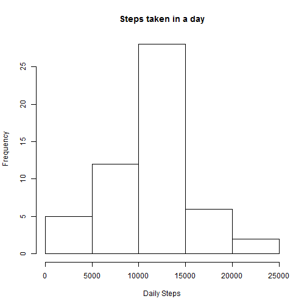
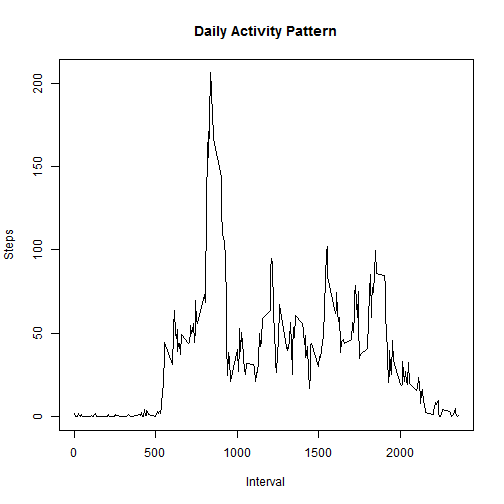
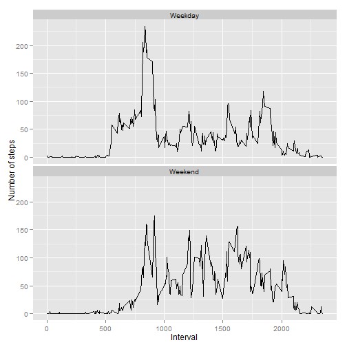

## Loading and preprocessing the data
The data is stored in a zipped CSV file, we'll load it in to the "data" variable.  We'll then transform the data into a data.table for easier use.


```r
library(data.table)
```

```
## data.table 1.9.4  For help type: ?data.table
## *** NB: by=.EACHI is now explicit. See README to restore previous behaviour.
## 
## Attaching package: 'data.table'
## 
## The following objects are masked from 'package:lubridate':
## 
##     hour, mday, month, quarter, wday, week, yday, year
```

```r
originaldata <- data.table(read.csv(unz("activity.zip", "activity.csv")))
```

Exclude all of the rows that have NA for the steps column


```r
data <- originaldata[!is.na(originaldata$steps), ]
data <- originaldata
```

## What is mean total number of steps taken per day?

Transform the data into daily totals by summing up the number of steps by day, using the aggregate function.  


```r
dailySteps <- aggregate(steps ~ date, data, sum)
```

Create a histogram out of the total number of steps taken in a day.


```r
hist(dailySteps$steps, xlab = "Daily Steps", main = "Steps taken in a day")
```

 

Take the results and calculate the mean and median of the "steps" variable.


```r
mean(dailySteps$steps)
```

```
## [1] 10766.19
```

```r
median(dailySteps$steps)
```

```
## [1] 10765
```


## What is the average daily activity pattern?

Transform the data into average steps taken in each five minute interval, using the mean.


```r
intervalSteps <- aggregate(steps ~ interval, data, mean)
```


Create a time series plot.


```r
plot(x = intervalSteps$interval, y = intervalSteps$steps, type = "l", xlab = "Interval", ylab = "Steps", main = "Daily Activity Pattern")
```

 

Use the max function to pull out the 5 minute interval that has the highest average number of steps.


```r
intervalSteps$interval[intervalSteps$steps == max(intervalSteps$steps)]
```

```
## [1] 835
```


## Imputing missing values

Calculate the total number of rows with missing values.


```r
sum(is.na(originaldata))
```

```
## [1] 2304
```

Fill in the NA data with the average values


```r
cleanedData <- originaldata
cleanedData$steps[is.na(cleanedData$steps)] <- mean(originaldata$steps)
```

Pull out the daily steps by summing up the number of steps by day, using the aggregate function.  


```r
dailySteps <- aggregate(steps ~ date, cleanedData, sum)
```

Create a histogram out of the total number of steps taken in a day.


```r
hist(dailySteps$steps, xlab = "Daily Steps", main = "Steps taken in a day")
```

 

Take the results and calculate the mean and median of the "steps" variable.


```r
mean(dailySteps$steps)
```

```
## [1] 10766.19
```

```r
median(dailySteps$steps)
```

```
## [1] 10765
```

The histogram, mean, and median values did not change at all by imputting the missing values.  This is because the imputted values were calculated by using the mean function.


## Are there differences in activity patterns between weekdays and weekends?

Create a new variable for tracking if the day is a weekday or a weekend.  Us the lubridate package to help out.


```r
library(lubridate)
cleanedData$isWeekend <- weekdays(ymd(cleanedData$date)) %in% c("Saturday", "Sunday")
```

Convert the data to intervals.


```r
intervalStepsWeekday <- aggregate(steps ~ interval, cleanedData[cleanedData$isWeekend == F, ], mean)
intervalStepsWeekday$weekendSegment = "Weekday"
intervalStepsWeekend <- aggregate(steps ~ interval, cleanedData[cleanedData$isWeekend == T, ], mean)
intervalStepsWeekend$weekendSegment = "Weekend"
intervalStepsFaceted = rbind(intervalStepsWeekend, intervalStepsWeekday)
```


Create the plots to compare the data


```r
library(ggplot2)

g <- ggplot(intervalStepsFaceted, aes(interval, steps))
g + geom_line() + facet_wrap(~ weekendSegment, nrow = 2) + labs(x = "Interval") + labs(y = "Number of steps")
```

 


